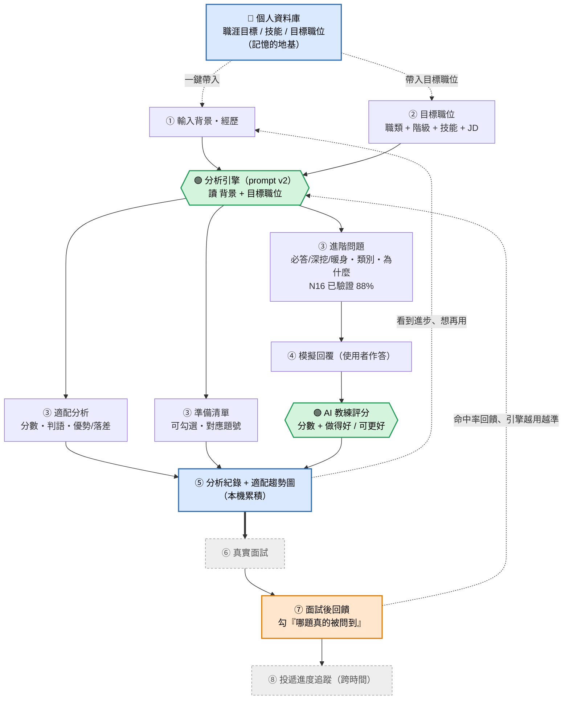

# 產品流程圖 — 求職分析

這是「求職分析」目前做出來的流程，加上未來的護城河閉環。
🟢 綠 = AI 引擎；🔵 藍 = 已做的記憶與累積；🟠 橘 = 護城河閉環（未來）；⚪ 灰虛線 = 未來功能。

---

---

## 對照：每一段做到哪、對應什麼

| 流程步驟 | 對應利基點 | 狀態 |
|---|---|---|
| 👤 個人資料庫 | 記憶的地基（N23 雛形） | ✅ 已做（本機 localStorage） |
| ③ 適配分析 | 適配度（觀察值） | ✅ 已做（demo 用，非驗證指標） |
| ③ 進階問題 | **N16 經歷歸納** | ✅ **已驗證**（v1→v2，嚴格 88% / ★ 經歷題 90%） |
| ③ 準備清單 | N19 可驗證性（上游） | ✅ 已做，尚未驗證有沒有用 |
| ④ 模擬回覆 + AI 評分 | 教練回饋 | ✅ 已做（後加的新功能） |
| ⑤ 分析紀錄 + 趨勢圖 | 記憶與累積 | ✅ 已做（跨次累積、看得到趨勢） |
| ⑥⑦ 面試後回饋閉環 | **N19 可驗證性（護城河）** | ⏳ 未來才做（需真實面試資料） |
| ⑧ 投遞進度追蹤 | 跨時間追蹤 | ⏳ 未來才做（需登入 / 雲端同步） |

## 對照：使用者旅程階段

- ①② 輸入 → ③ 輸出：**引擎主戰場**（面試前準備，能力適配 → 驗證可行性）
- ④ 模擬回覆：把「知道會被問」延伸到「練過、拿到回饋」——教練體驗
- ⑤ 累積：個人資料 + 分析紀錄 + 趨勢圖 = 記憶的雛形（ChatGPT 結構上做不到跨時間追蹤）
- ⑥⑦ 面試後回饋：閉環的起點，也是護城河真正落地的地方（需真實面試）
- ⑧ 投遞進度：把累積的成功指標攤給使用者看 → 留存引擎

## 一句話

> 綠色引擎（進階問題）＝ 這次已驗證的 N16；
> 藍色的個人資料 + 分析紀錄 + 趨勢圖 ＝ 護城河「記憶與累積」的雛形（已做出可操作版）；
> 橘色的面試後回饋閉環 ＝ N19 護城河真正的長期價值，需要真實面試資料才跑得起來（未來）。
