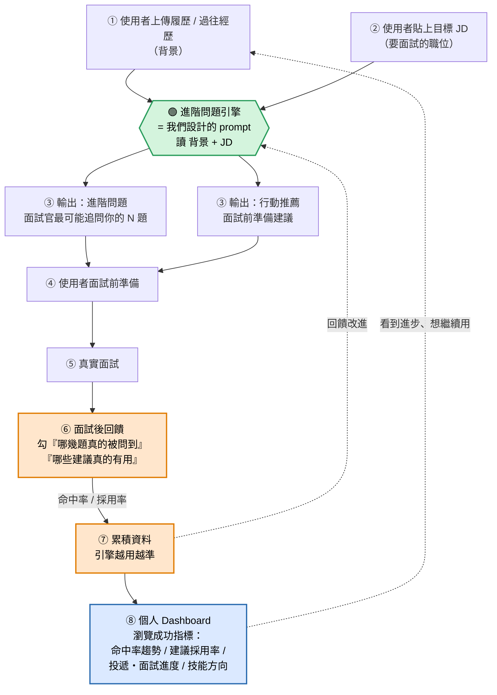

# 未來產品流程圖 — prompt 在哪裡跑

這支 prompt（今天做的 v1/v2）未來在產品裡的位置。
🟢 綠色 = prompt 引擎；🟠 橘色 = 護城河閉環（記憶累積）；🔵 藍色 = 使用者 Dashboard。

---

---

## 對照：這次 MVP 驗證了哪一段

| 流程步驟 | 對應利基點 | 這次 MVP 有沒有驗證 |
|---|---|---|
| ③ 進階問題輸出 | **N16 經歷歸納** | ✅ 驗證了（命中率 v1→v2） |
| ③ 行動推薦輸出 | **N19 可驗證性（上游）** | 🔶 有產出，未驗證有沒有用 |
| ⑥⑦ 面試後回饋累積 | **N19 可驗證性（護城河）** | ⏳ 未來才做（需真實面試） |
| ⑧ 個人 Dashboard | **資料累積價值（N23）+ 留存** | ⏳ 未來才做（MVP 明確不做） |

## 對照：使用者旅程階段

- ③ 能力適配 → ④ 驗證可行性：**引擎主要戰場**（面試前準備）
- ⑤ 決策定案 → 回到 ⑥ 回饋：**閉環的起點**（面試後勾選）
- ⑦ 累積：這就是「記憶與累積」護城河——ChatGPT 結構上做不到跨時間追蹤
- ⑧ Dashboard：把累積的成功指標攤給使用者看 → 看到進步就想繼續用（留存引擎，對應解法 #4 目標與獎勵，旅程 ⑥ 重新進入循環）

## 一句話

> 今天做的 prompt = 圖中綠色的「③ 引擎」。
> 這次 MVP 驗證的是它的輸出品質（N16）；
> 橘色的回饋閉環（N19 護城河）是未來要補的，需要真實面試資料才跑得起來。
